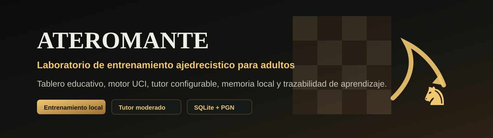

<div align="center">



# ATEROMANTE

**Laboratorio local de entrenamiento ajedrecistico para adultos con tablero educativo, tutor configurable, motor UCI y trazabilidad de aprendizaje.**

**Martin Munive**<br>
Medico general<br>
Analista y programador de software

[](https://www.typescriptlang.org/)
[](https://react.dev/)
[](https://vite.dev/)
[](https://www.sqlite.org/)
[](LICENSE)
[](https://github.com/sponsors/Martin-Munive)
[](#estado-del-proyecto)

</div>

> ATEROMANTE is an early training-lab prototype. It is not a cheating tool and must not be used for hidden live assistance in competitive games against humans.

## Que Es

`ATEROMANTE` es una aplicacion local-first para estudiar ajedrez con una superficie visual propia: tablero educativo, panel de tutor, analisis de motor, arbol de variantes, reportes y memoria de aprendizaje.

El objetivo es ayudar a adultos que empiezan o retoman ajedrez a entrenar de forma estructurada, medible y trazable. El sistema busca convertir partidas, errores, explicaciones y ejercicios en conocimiento consultable.

## Por Que Importa

Muchos estudiantes adultos acumulan libros, puzzles y partidas, pero pierden la conexion entre:

- que jugaron;
- que error cometieron;
- que explicacion recibieron;
- que tema deben repasar;
- en que partida aparecio la idea;
- cuando deben volver a practicarla.

ATEROMANTE trata cada partida como una fuente de aprendizaje. Cada posicion relevante debe poder volver a abrirse, buscarse, etiquetarse y conectarse con ejercicios o repasos.

## Capacidades Planeadas

- Tablero educativo con flechas, resaltados y variantes.
- Tutor configurable por nivel de ayuda.
- Analisis con motor UCI.
- Importacion/exportacion PGN y FEN.
- Base local SQLite para partidas, posiciones, movimientos y eventos de aprendizaje.
- Busqueda por apertura, tema, fase, error, posicion o explicacion.
- Reportes de debilidades, fortalezas y progreso.
- Sesiones humano-humano de entrenamiento con servidor/moderador.
- Modos de tutor: apagado, silencioso, pista, tactico, estrategico, clase completa.

## Modelo Cliente/Servidor

El proyecto contempla dos roles:

- **Cliente jugador:** juega, recibe politica de la sala y conserva su tutor/memoria local.
- **Servidor/moderador:** crea la sala, aprueba participantes y activa o desactiva tutor, motor, ayuda privada, ayuda simetrica, clase compartida o analisis post-partida.

Las partidas humano-humano asistidas son solo para entrenamiento consentido. La sala debe declarar visiblemente si hay ayuda activa y si la exportacion queda marcada como partida asistida.

## Estado Del Proyecto

Estado actual: **spike tecnico inicial**.

Implementado:

- app React/Vite;
- pantalla operativa de laboratorio;
- tablero visual con click-to-move, movimientos legales y ayudas de ultima jugada;
- puente API local para que la UI cree sesiones y persista movimientos;
- panel de tutor simulado;
- panel de motor simulado;
- arbol de variantes simulado;
- modelo inicial de roles cliente/moderador;
- persistencia local SQLite v0.1 con event log;
- repositorios locales para sesiones, partidas, posiciones, movimientos y aprendizaje;
- `GameService` local con `chess.js` para reglas, FEN, PGN y movimientos legales;
- adaptador de proceso UCI externo con validacion, timeout y profundidad limitada;
- endpoint local de analisis con persistencia de evaluacion, mejor jugada y variante principal;
- panel de motor con estados de carga/error/exito y flecha educativa para la mejor jugada;
- recuperacion visual de sesiones persistidas desde el historial local;
- tests de persistencia con `node:test`;
- entorno local documentado;
- QA visual con Playwright;
- build y lint funcionales.

Pendiente:

- validar la integracion contra un binario Stockfish real en los entornos soportados;
- importador PGN/FEN;
- tutor LLM configurable por API;
- servidor/moderador real;
- conectores a plataformas o bases externas.

## Instalacion Local

Requisitos:

- Node.js 26 o compatible.
- npm 11 o compatible.

Instalar dependencias localmente:

```powershell
npm install
```

Ejecutar solo la UI en desarrollo:

```powershell
npm run dev
```

Ejecutar UI con API local y SQLite:

```powershell
npm run dev:local
```

Abrir:

```text
http://127.0.0.1:5173
```

## Verificacion

```powershell
npm run build
npm run lint
npm test
npm run qa:visual
npm run qa:interaction
```

`qa:visual` genera capturas locales en `qa-artifacts/`, carpeta excluida de Git.

## Arquitectura Inicial

```text
React/Vite UI
  -> chessboard
  -> tutor panel
  -> variation tree
  -> dashboard

Local app layer
  -> Local API
  -> Game Service
  -> Session Service
  -> Match Policy Service
  -> Moderator Service
  -> Engine Service
  -> Tutor Service
  -> Metrics Service

Local storage
  -> SQLite
  -> PGN/FEN import/export

Local backend
  -> node:sqlite
  -> event log
  -> persistence repositories
```

## Trazabilidad De Aprendizaje

La base de datos debe conectar:

- partida;
- posicion;
- movimiento;
- evaluacion del motor;
- explicacion del tutor;
- tema de aprendizaje;
- error o fortaleza;
- ejercicio derivado;
- proxima fecha de repaso.

Ejemplo de uso esperado:

> "Muestrame donde aprendi la idea de caballo fuerte en d5 contra la Siciliana."

El sistema debe responder con la partida, posicion, explicacion, variantes y ejercicios relacionados.

## Documentacion

- [Architecture draft](docs/ARCHITECTURE-DRAFT.md)
- [Backlog](docs/BACKLOG.md)
- [Client/server model](docs/CLIENT-SERVER-MODEL.md)
- [Data traceability](docs/DATA-TRACEABILITY.md)
- [Environment](docs/ENVIRONMENT.md)
- [GitHub settings](docs/GITHUB-SETTINGS.md)
- [LLM providers](docs/LLM-PROVIDERS.md)
- [MITNICK gates](docs/MITNICK-GATES.md)
- [Renaming protocol](docs/RENAMING-PROTOCOL.md)
- [Spike plan](docs/SPIKE-PLAN.md)

## Limites

- No incluye material privado de estudio.
- No incluye bases de datos de terceros.
- No debe usarse para asistencia oculta en partidas competitivas.
- Stockfish no se distribuye dentro del repositorio: el usuario debe configurar un ejecutable UCI externo.
- La integracion UCI esta verificada con un motor controlado de pruebas; falta la validacion contra Stockfish real en cada plataforma soportada.
- Las funciones LLM reales todavia no estan conectadas a proveedores externos.

## Roadmap Publico

1. Conectar `GameService` al tablero visual.
2. Crear modelo local completo de sesiones, eventos y politicas de ayuda.
3. Expandir SQLite para importacion PGN, revisiones y reportes.
4. Conectar Stockfish/UCI.
5. Importar/exportar PGN/FEN.
6. Construir reportes post-partida.
7. Agregar tutor LLM configurable por API.
8. Prototipar servidor/moderador.
9. Agregar busqueda por temas, aperturas y posiciones.

## Autor

**Martin Munive**  
Medico general. Analista y programador de software.

## Licencia

El codigo del repositorio se distribuye bajo GNU Affero General Public License v3.0 or later. La documentacion y los activos originales del repositorio usan Creative Commons Attribution 4.0 International salvo que un archivo indique otra cosa.

Para citar el proyecto, usa `CITATION.cff`. Para soporte, patrocinio o licenciamiento comercial alternativo, revisa [Commercial licensing and support](COMMERCIAL-LICENSING.md).
